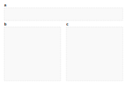
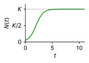
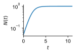
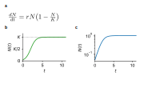

# pc — Panel Compiler

Compose scientific figures from SVG plots, PDF figures, standalone TeX figures, and LaTeX equations into a single SVG or PDF panel.
This is intended for the case that these subfigures are
generated by scripts and you automatically want to keep your panels up to date.

Define a panel template in Inkscape with named group (`<g>`) or rectangle (`<rect>`) placeholders (set via the layer/group label field), then write a small YAML config that maps each label to an SVG file, PDF, standalone `.tex` file, or a LaTeX string. `pc` scales each figure to fit its placeholder and writes the compiled panel.
It is often convenient to let `pc` overwrite the old panel (labels are preserved for repeated execution).

## Example

An example is given in `example`.
Assume you would like to create a panel with 3 subfigures.
Two are figures created via `python` code, and one contains a LaTeX formula.

We start from the panel template `example/panel.svg` that was created in Inkscape.
Here, the template is simple and contains only three `rect` placeholders, each of which has set its `label` (via Inkscape) set to one of: `formula`, `logistic`, and `logistic_log`.

This is the panel:



The `python` script that generates the subfigures is `example/subfigures.py` with the following
subfigures being generated:

| `logistic.svg` | `logistic_log.svg` |
|:--------------:|:------------------:|
|  |  |

Next we prepared a configuration `example/pc.yaml` that tells the panel-compiler how to
compile the panel:
```yaml
panel: panel.svg
output:
  - out.svg
  - panel.pdf

formula:
  tex: $\frac{dN}{dt} = rN\!\left(1 - \frac{N}{K}\right)$
  size: 10pt

logistic:
  file: logistic.svg
  fit: contain

logistic_log:
  file: logistic_log.svg
  fit: contain
```

The panel is finally compiled via:

```bash
cd example
python subfigures.py
pc pc.yaml
```

Resulting in the generation of `example/out.svg`:




## Installation

From PyPI:

```bash
uv tool install panel-compiler
```

or with pip:

```bash
pip install panel-compiler
```

From the repository:

```bash
uv tool install git+https://github.com/mfuegger/pc.git
```

or with pip:

```bash
pip install git+https://github.com/mfuegger/pc.git
```

For LaTeX rendering and standalone `.tex` figures, `pdflatex` must be on your `PATH`. For PDF/TeX figures and PDF output, `pdf2svg` and `inkscape` must be on your `PATH`. On macOS: `brew install pdf2svg`.

## Usage

```
pc [config.yaml]
```

| Argument | Default | Description |
|---|---|---|
| `config.yaml` | `pc.yaml` | YAML config (see below) |

The output path is taken from the `output` key in the config. If omitted, it defaults to the config filename with `.svg` extension (e.g. `pc.yaml` → `pc.svg`).

## Config format

### Single panel

```yaml
panel: panel.svg    # required — path to the panel SVG, relative to this config file
output: out.svg     # optional — defaults to <config-stem>.svg if omitted
content_style: "stroke: none; fill: initial;"  # optional — empty by default
```

`output` can also be a list to produce multiple formats in one run. Supported
formats are SVG, PDF, and PNG (chosen by the file extension); PDF and PNG are
exported through Inkscape:

```yaml
output:
  - out.svg
  - out.pdf
  - out.png
```

For raster output, set the resolution per entry with `dpi` (the panel's physical
`width`/`height` in mm then fix the pixel dimensions). Either nest the options
under the filename or use the explicit `file:` form:

```yaml
output:
  - out.svg
  - out.png:        # keyed form
      dpi: 600
  - file: thumb.png # file form
    dpi: 150
```

`dpi` is ignored for SVG; for PDF it sets the resolution at which Inkscape
rasterises filter effects (drop shadows, blurs).

`content_style` is an optional CSS declaration block applied to all paths, circles, and polygons inside embedded SVG figures. It is **empty by default**, so each figure keeps its own strokes and fills. Set it only when the panel template ships type-selector rules (e.g. a `<style>` with `path { stroke: ... }`) that would otherwise bleed into embedded content; the value then overrides them (e.g. `stroke: none; fill: initial;`). LaTeX labels always get `stroke: none` regardless of this setting.

Each remaining key is a **label** that must match an element in the panel SVG. `pc` looks it up by `inkscape:label` first, then `label`, then `id`. The element can be a `<g>` group or a `<rect>` placeholder — a `<rect>` is automatically replaced by a `<g>` positioned at the rect's `x`/`y`. A warning (including the panel filename) is emitted for any label not found; compilation of the remaining entries continues.

### Figure entry (SVG, PDF, or TeX)

```yaml
plot:
  file: results.svg   # path relative to this config file; .svg, .pdf, or .tex  (alias: svg:)
  fit: contain        # contain | height | width  (default: contain)
  width: 200          # optional — override the target width  (SVG user units)
  height: 100         # optional — override the target height (SVG user units)
```

Fit strategies:
- `contain` — scale uniformly to fit within the placeholder box (default)
- `height` — scale to match the placeholder height exactly
- `width`  — scale to match the placeholder width exactly

Target dimensions come from `width`/`height` attributes on the group element in the panel SVG. The config `width`/`height` are used as a fallback when the group has no such attributes.

PDF files are converted via `pdf2svg` before embedding. TeX files are compiled with `pdflatex`, converted via `pdf2svg`, then embedded and scaled like SVG/PDF figures.

Use `.tex` files for complete documents, not snippets. In practice these are often `standalone` documents containing TikZ, algorithms, proof trees, tables, or anything else that is easier to draw in LaTeX than in Inkscape:

```yaml
algorithm:
  file: algorithm.tex
  fit: contain
```

For example:

```tex
\documentclass[tikz,border=2pt]{standalone}
\usepackage{tikz}

\begin{document}
\begin{tikzpicture}
  \draw (0,0) rectangle (2,1);
  \node at (1,.5) {example};
\end{tikzpicture}
\end{document}
```

If the TeX file does not compile, `pc` prints the `pdflatex` command, the working directory, the exit code, and the tail of the LaTeX log. That usually includes the familiar `file.tex:line: error` message, so the first thing to check is the reported line in the `.tex` file. The file is compiled from its own directory, so relative `\input{...}` and image paths should be written as they would be when running `pdflatex` next to that file.

### LaTeX entry

```yaml
label:
  tex: $y = \sin(x)$   # any LaTeX — math mode, text, amsmath, …
  size: 12pt           # font size (default: 10pt); scales the rendered output
```

Rendered via `pdflatex` + `inkscape`. No fit scaling — the output is sized by `size` alone.

### Shorthand

A plain string value is treated as an SVG file path with `fit: contain`:

```yaml
other: path/to/fig.svg
```

### Multiple panels

Use a YAML list; each entry must have its own `output`. A plain mapping (non-list) with duplicate keys — the easy mistake when copy-pasting a second panel block — triggers a warning and the second value silently wins; use the list form to avoid this.

```yaml
- panel: panel1.svg
  output: out1.svg
  plot:
    file: results.svg

- panel: panel2.svg
  output:
    - out2.svg
    - out2.pdf
  label:
    tex: $E = mc^2$
    size: 12pt
```

## License

Apache 2.0 — see [LICENSE](LICENSE).
